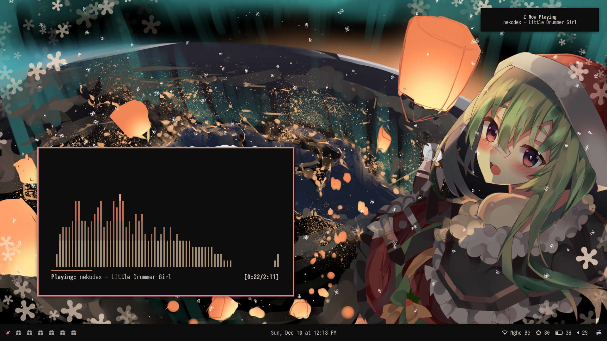
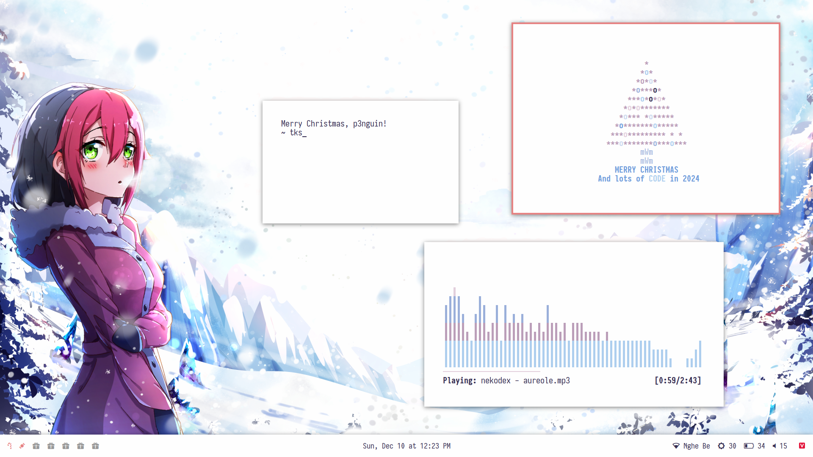

# p3nguin-kun's Chrismas Dotfiles
My cozy Christmas Linux setup
| Dark | Light |
| :----- | :------ |
|  |  |

# Info
- 🖼️ Wallpaper: [Leissss's osu! Winter Fanart 2017](https://osu.ppy.sh/home/news/2017-12-14-winter-is-here) and [Xeno Senpai's osu! Winter Fanart 2019](https://osu.ppy.sh/home/news/2019-12-10-winter-is-here) 
- 🪟 Window Manager: [bspwm](https://github.com/baskerville/bspwm)
- 👨‍💻 Terminal: [Alacritty](https://alacritty.org/)
- 🌐 Browser: [Firefox](https://www.mozilla.org/en-US/firefox)
- 🗃️ File manager: [Ranger](https://ranger.github.io/)/[PCManFM](https://github.com/lxde/pcmanfm)
- 🗒️ Text editor: [NeoVim](https://neovim.io)
- 📄 PDF Viewer: [Zathura](https://pwmt.org/projects/zathura/)
- 📅 Calendar: [Calcurse](https://www.calcurse.org/)
- 📼 Video player: [mpv](https://mpv.io)
- 🎶 Music player: [ncmpcpp](https://github.com/ncmpcpp/ncmpcpp)
- 📜 Fetch: [Neofetch](https://github.com/dylanaraps/neofetch)
- 🤖 System monitor: [Htop](https://htop.dev)
- 🖥️ Manage screens: [ARandR](https://christian.amsuess.com/tools/arandr/)
- 💴 Free Robux: [Here](https://youtu.be/dQw4w9WgXcQ)

# Installation
```
git clone https://github.com/p3nguin-kun/unixporn-dotfiles -b christmas
cd unixporn-dotfiles
sudo ./install.sh
```
